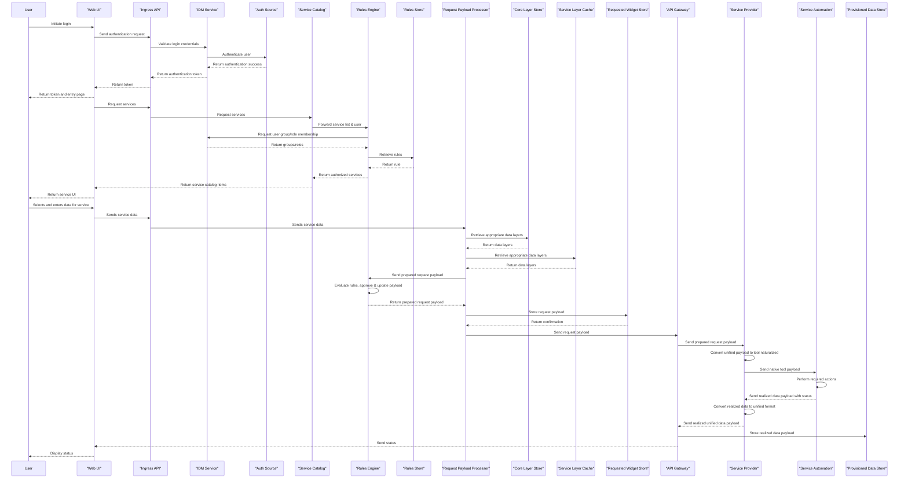

```mermaid
sequenceDiagram
    participant User
    participant WebUI as "Web UI"
    participant IngressAPI as "Ingress API"
    participant IDM as "IDM Service"
    participant AuthSource as "Auth Source"
    participant ServiceCatalog as "Service Catalog"
    participant RulesEngine as "Rules Engine"
    participant RulesStore as "Rules Store"
    participant RequestProcessor as "Request Payload Processor"
    participant CoreLayerStore as "Core Layer Store"
    participant ServiceLayerCache as "Service Layer Cache"
    participant RequestedWidgetStore as "Requested Widget Store"
    participant APIGateway as "API Gateway"
    participant ServiceProvider as "Service Provider"
    participant ServiceAutomation as "Service Automation"
    participant ProvisionedDataStore as "Provisioned Data Store"

    %% User Login
    User->>WebUI: Initiate login
    WebUI->>IngressAPI: Send authentication request
    IngressAPI->>IDM: Validate login credentials
    IDM->>AuthSource: Authenticate user
    AuthSource-->>IDM: Return authentication success
    IDM-->>IngressAPI: Return authentication token
    IngressAPI-->>WebUI: Return token
    WebUI-->>User: Return token and entry page

    %% List Services
    WebUI->>IngressAPI: Request services
    IngressAPI->>ServiceCatalog: Request services
    ServiceCatalog->>RulesEngine: Forward service list & user
    RulesEngine->>IDM: Request user group/role membership
    IDM-->>RulesEngine: Return groups/roles
    RulesEngine->>RulesStore: Retrieve rules
    RulesStore-->>RulesEngine: Return rule
    RulesEngine-->>ServiceCatalog: Return authorized services
    ServiceCatalog-->>WebUI: Return service catalog items
    WebUI-->>User: Return service UI

    %% Request Service
    User->>WebUI: Selects and enters data for service
    WebUI->>IngressAPI: Sends service data
    IngressAPI->>RequestProcessor: Sends service data
    RequestProcessor->>CoreLayerStore: Retrieve appropriate data layers
    CoreLayerStore-->>RequestProcessor: Return data layers
    RequestProcessor->>ServiceLayerCache: Retrieve appropriate data layers
    ServiceLayerCache-->>RequestProcessor: Return data layers
    RequestProcessor->>RulesEngine: Send prepared request payload
    RulesEngine->>RulesEngine: Evaluate rules, approve & update payload
    RulesEngine-->>RequestProcessor: Return prepared request payload
    RequestProcessor->>RequestedWidgetStore: Store request payload
    RequestedWidgetStore-->>RequestProcessor: Return confirmation
    RequestProcessor->>APIGateway: Send request payload

    %% Service Realization
    APIGateway->>ServiceProvider: Send prepared request payload
    ServiceProvider->>ServiceProvider: Convert unified payload to tool naturalized
    ServiceProvider->>ServiceAutomation: Send native tool payload
    ServiceAutomation->>ServiceAutomation: Perform required actions
    ServiceAutomation-->>ServiceProvider: Send realized data payload with status
    ServiceProvider->>ServiceProvider: Convert realized data to unified format
    ServiceProvider-->>APIGateway: Send realized unified data payload
    APIGateway->>ProvisionedDataStore: Store realized data payload
    APIGateway-->>WebUI: Send status
    WebUI-->>User: Display status
``` 