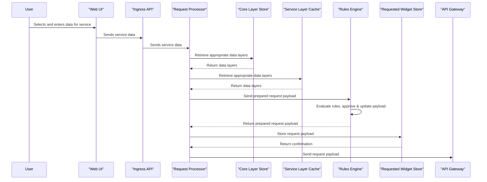

```mermaid
sequenceDiagram
    participant User
    participant WebUI as "Web UI"
    participant IngressAPI as "Ingress API"
    participant RequestProcessor as "Request Processor"
    participant CoreLayerStore as "Core Layer Store"
    participant ServiceLayerCache as "Service Layer Cache"
    participant RulesEngine as "Rules Engine"
    participant RequestedWidgetStore as "Requested Widget Store"
    participant APIGateway as "API Gateway"

    User->>WebUI: Selects and enters data for service
    WebUI->>IngressAPI: Sends service data
    IngressAPI->>RequestProcessor: Sends service data
    RequestProcessor->>CoreLayerStore: Retrieve appropriate data layers
    CoreLayerStore-->>RequestProcessor: Return data layers
    RequestProcessor->>ServiceLayerCache: Retrieve appropriate data layers
    ServiceLayerCache-->>RequestProcessor: Return data layers
    RequestProcessor->>RulesEngine: Send prepared request payload
    RulesEngine->>RulesEngine: Evaluate rules, approve & update payload
    RulesEngine-->>RequestProcessor: Return prepared request payload
    RequestProcessor->>RequestedWidgetStore: Store request payload
    RequestedWidgetStore-->>RequestProcessor: Return confirmation
    RequestProcessor->>APIGateway: Send request payload
```