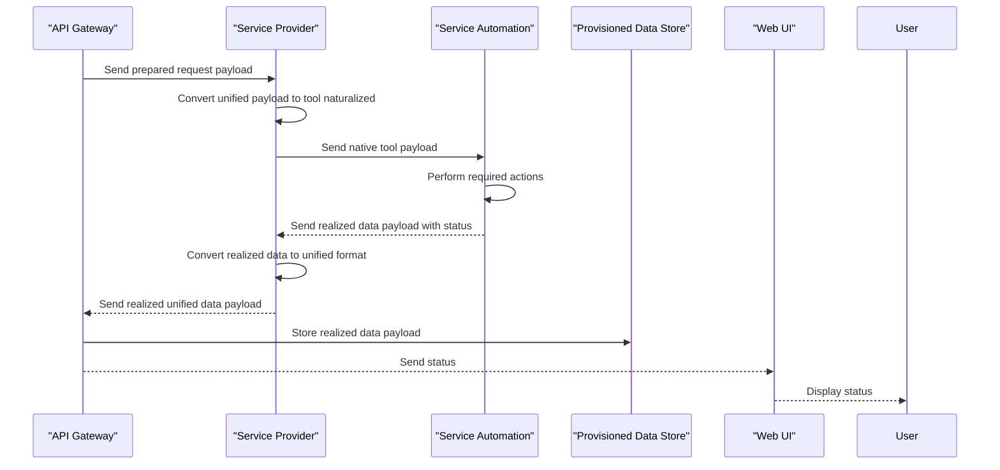

```mermaid
sequenceDiagram
    participant APIGateway as "API Gateway"
    participant ServiceProvider as "Service Provider"
    participant ServiceAutomation as "Service Automation"
    participant ProvisionedDataStore as "Provisioned Data Store"
    participant WebUI as "Web UI"
    participant User

    APIGateway->>ServiceProvider: Send prepared request payload
    ServiceProvider->>ServiceProvider: Convert unified payload to tool naturalized
    ServiceProvider->>ServiceAutomation: Send native tool payload
    ServiceAutomation->>ServiceAutomation: Perform required actions
    ServiceAutomation-->>ServiceProvider: Send realized data payload with status
    ServiceProvider->>ServiceProvider: Convert realized data to unified format
    ServiceProvider-->>APIGateway: Send realized unified data payload
    APIGateway->>ProvisionedDataStore: Store realized data payload
    APIGateway-->>WebUI: Send status
    WebUI-->>User: Display status
```