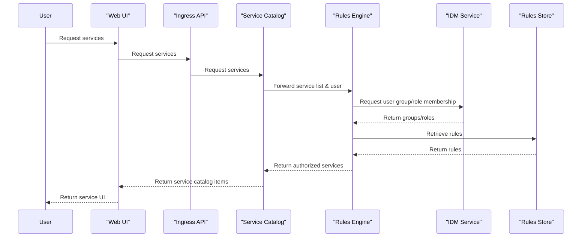

```mermaid
sequenceDiagram
    participant User
    participant WebUI as "Web UI"
    participant IngressAPI as "Ingress API"
    participant ServiceCatalog as "Service Catalog"
    participant RulesEngine as "Rules Engine"
    participant IDM as "IDM Service"
    participant RulesStore as "Rules Store"

    User->>WebUI: Request services
    WebUI->>IngressAPI: Request services
    IngressAPI->>ServiceCatalog: Request services
    ServiceCatalog->>RulesEngine: Forward service list & user
    RulesEngine->>IDM: Request user group/role membership
    IDM-->>RulesEngine: Return groups/roles
    RulesEngine->>RulesStore: Retrieve rules
    RulesStore-->>RulesEngine: Return rules
    RulesEngine-->>ServiceCatalog: Return authorized services
    ServiceCatalog-->>WebUI: Return service catalog items
    WebUI-->>User: Return service UI
```