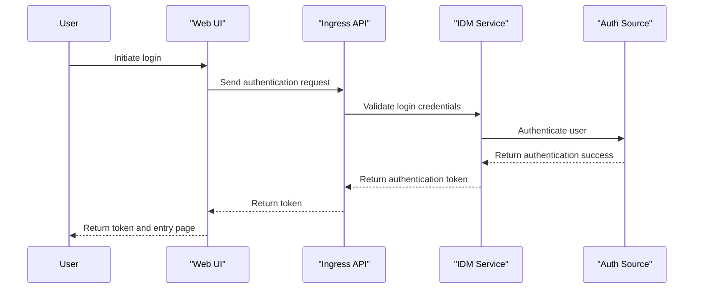

```mermaid
sequenceDiagram
    participant User
    participant WebUI as "Web UI"
    participant IngressAPI as "Ingress API"
    participant IDM as "IDM Service"
    participant AuthSource as "Auth Source"

    User->>WebUI: Initiate login
    WebUI->>IngressAPI: Send authentication request
    IngressAPI->>IDM: Validate login credentials
    IDM->>AuthSource: Authenticate user
    AuthSource-->>IDM: Return authentication success
    IDM-->>IngressAPI: Return authentication token
    IngressAPI-->>WebUI: Return token
    WebUI-->>User: Return token and entry page
```