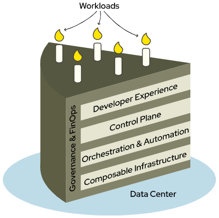

# Taxonomy of DCM

This taxonomy of DCM achieves three key goals. First, it defines the top-level domains that distinguish  the functions and roles of the DCM architecture. Next, it defines a specific vocabulary with the intent of enabling precision and clarity by eliminating ambiguity. Finally, an "anti-vocabulary" defines a list of ambiguous phrases and "weasel words" to avoid and recommends more specific terms to use instead.

## Top-level architectural domains

The taxonomy defines the functional areas enabled by the DCM architectural as five top-level domains. Each domain maps a set of DCM services and resources defined by the architecture to the different roles and teams across an organization that experience them.

The top-level domains are defined as follows:

1. **Developer Experience** - This domain delivers the Unified interface that Developers and Application Owners use to request and manage Services from DCM. It includes the Service Catalog listing the available Services. Multi-tenancy is experienced at this level.
2. **Control Plane** - This is the central nervous system of DCM. It maintains the Unified API and Data Model including the inventory of Fulfilled Services. It also enforces authentication and role-based access control.
3. **Orchestration & Automation** - This domain contains the code and workflows for provisioning and managing the Resources required to Fulfill Sefvice request. It provides the engines that execute requests from the Control Plane and translates those into API calls supported by specific Infrastructure Platforms hosted under the Composable Infrastructure domain.
4. **Composable Infrastructure** - This domain represents the physical and virtual assets in the data center. This is where the basic compute, storage and networking Resources are provisioned.
5. **Governance & FinOps** - This domain is the set of overarching requirements that ensure DCM operations are secure, compliant, and cost-effective. It encompasses policy management, real-time metrics, and cost allocation.

Everything in the DCM architecture exists under one of these domains.

How these domains are connected can be easily understood using a layer cake analogy.

Each layer of cake represents a domain that interacts only with the domains directly above and below it. For example, the architecture prohibits a direct connection from the Developer Experience domain to the Orchestration & Automation domain, Instead, Developer Experience must always use the Control Plane to request and manage resources available from the lower domains.

The exception to this rule is the Governance & FinOps domain. It is the frosting of our cake and it touches all the layers. This aligns with the overarching functions of the Governance & FinOps domain requiring observability at every level of the architecture.

## Vocabulary

DCM is a complex technology architecture stretching from the depths of bare metal on data center floor up to the high-level abstractions required to achieve secure multi-tenancy in the service of cloud consuming application owners and developers.

The vocabulary we use to define this architecture demands precision and clarity. By allowing a term to have a distinct, contextual definition within each architectural domain, we can eliminating ambiguity even when using the same words.

For example, the "resource" a developer requests for their application is a logical entity, for example, a "Web App Service." However, the "resource" that the Infrastructure Operations team manages is a physical asset like a specific VM with a particular IP address. By providing distinct definitions for the same term in each domain, we avoid confusion as we navigate through the architectural domains.

When adding new terms to the vocabulary, take care to map the terms to the roles and functions relevant to each applicable domain.

### Application

An Application is a defined collection of Services used to deploy a self-contained software solution designed to meet a specific business purpose. An Application is full-stack product typically including a front-end user interface, business logic, data storage, and potentially network interfaces to other Applications.

### Data Model

The Data Model defines the scope of Unified data within the Control Plane. The Data Model includes static data as well as event data such as the history of Fulfilled Service requests and time series data such as Workload usage metrics. Data Model does not mean database, but rather is a broader term meaning the scope of any data supporting the DCM architecture. While static data may be stored using a traditional database service, data from Service requests is better sent to an event logging service and usage metrics would be more suitably captured and stored in a time series data platform.

The Data Model also includes code, for example, the YAML data that defines the Resources and other parameters of Service Catalog item. Any data that is maintained as code would be managed and stored using Git repositories.

Dynamic data also falls under the scope of the Data Model. For example, the state of a provisioned Resource is data, but it is not stored, per se. Dynamic data may be queried using the Unified API.

### Infrastructure Platform

Infrastructure Platforms refer to the Data Center infrastructure and platforms that provide Resources within the Composable Infrastructure domain. An Infrastructure Platform may be physical hardware or a software platform, for example, bare metal servers, network gear, storage arrays, virtualization platforms, Kubernetes clusters, etc. Each Infrastructure Platform defines the physical and/or virtual Resources it supports, such as compute, storage, network, VM instances, Kubernetes cluster objects, etc.

An Infrastructure Platform provides an API used by a Service Provider to provision, decommission, make state changes to and enable discovery of the Resources it supports. Infrastructure Platforms must also expose event logging and metrics collection to the Governance & FinOps domain required to support monitoring, observability and billing.

### Multi-tenant

DCM multi-tenancy is experienced at the Developer Experience domain and enforced by the Control Plane.

The Orchestration & Automation and Composable Infrastructure domains operate in "privileged mode” to implement the isolation and confinement required for multi-tenancy.

The Governance & FinOps domain has access to the tenant-wide scope required to implement policy management, monitoring and billing.

### Placement

Workload Placement policies are managed within the Governance & FinOps domain and enforced within the Control Plane domain.

### Region

A Region is a large, geographically distinct area that hosts Resources. It can be a single Data Center or a group of Data Centers in close proximity. Regions should be designed as physically and logically independent from other Regions. This design is crucial for disaster recovery and business continuity, so a failure in one region doesn't affect another.

### Service

In the absence of further context, a Service is the specific capability defined by a Service Catalog item within the Developer Experience domain. Services provide the underlying Resources that Applications rely on. They are often designed to be reusable for multiple Applications. A Service could simply define a single underlying Resource, but more capable Services will define a configuration of many connected Resources. Compound Services may be defined by composing a number of simple Services under a single Service Catalog item.

Take care not confuse Services as defined above with what Service Providers deliver within the Composable Infrastructure domain. Contrary to what the name implies, Service Providers define and provision Resources, not Services. If you must, you could say Service Providers manage Infrastructure Services. Likewise, other services should also be disambiguated, for example, DNS service, database service, room service, etc.

### Service Provider

Service Providers support provisioning and management of Resources required to Fulfill Service requests from the Control Plane in a way that is agnostic to the implementations of different Infrastructure Platforms. Service Providers implement the Naturalization required to translate Unified API requests from the Control Plane into an Infrastructure Platform’s native API and the Denaturalization required to translate native API responses into responses that comply with the Unified API.

Service Providers will typically be implemented to support a single specific Infrastructure Platform. However, a Service Provider could also be implemented to support a class of Infrastructure Platforms, for example, one Service Provider supporting a number of different virtualization platforms.

### User

In the absence of further context, a User is the human consumer of cloud computing resources and services experiencing DCM from the Developer Experience domain. Of course, other humans "use" DCM within the other domains, so consider using Developer or Application Owner instead.

To avoid confusion, avoid using User when referring to humans acting within the the other DCM domains. Consider more specific persona alternative terms such as Platform Engineer, Infrastructure Operations, Policy Owner, Risk and Compliance Manager, etc.

### Workload

A Workload is a running instance of a Service that has been Fulfilled at the request of a User in the Developer Experience domain. A Workload is composed of the provisioned Resources required by the Service. The State and usage of the Workload's Resources are monitored by tools in the Governance & FinOps domain to enable observability and billing for Services.

### Zone

Also known as an Availability Zone, a Zone is an isolated group of Resources within a Region. Each Region consists of one or more Zones. A Zone is a separate physical facility with its own power, cooling, and networking, ensuring that a problem in one Zone, like a power outage or a localized fire, doesn't impact other Zones in the same Region. By deploying Resources across multiple Zones within a single Region, high availability and fault tolerance can be achieved for Services and Applications. Zones are defined by Infrastructure Platforms and can be namespaces, clusters or anything that results in its Resources being isolated as spelled out above.

## Anti-vocabulary

The goal of the anti-vocabulary is to encourage clarity and discipline in technical communication by pointing out ambiguous terms to avoid while explaining the concrete reasons and offering clear alternatives to consider instead.

### Data Center

The term Data Center isn't relevant from a DCM architecture perspective. It is simply a building that provides the roof over an arbitrary collection of physical infrastructure. Consider using the more architecturally meaningful terms Region and Zone.

### Realize

To realize can mean to bring something into existence, to make something intangible less so, to achieve a goal, or even just to understand as in "Ah, now I realize what's going on." Given all these meanings, avoid using this word. Consider more precise words like provision as in a VM, install as in a software package, fulfill as in a request, etc.

### Tangible

Nothing in the DCM architecture is intangible. Tangible and intangible are weasel words that sound important but don't add any clarity or meaning. Avoid using these words.

### Widgets

Widget are things, but what things exactly? Rather than saying widgets, find the precise word for the resource or service for the thing you are talking about.
